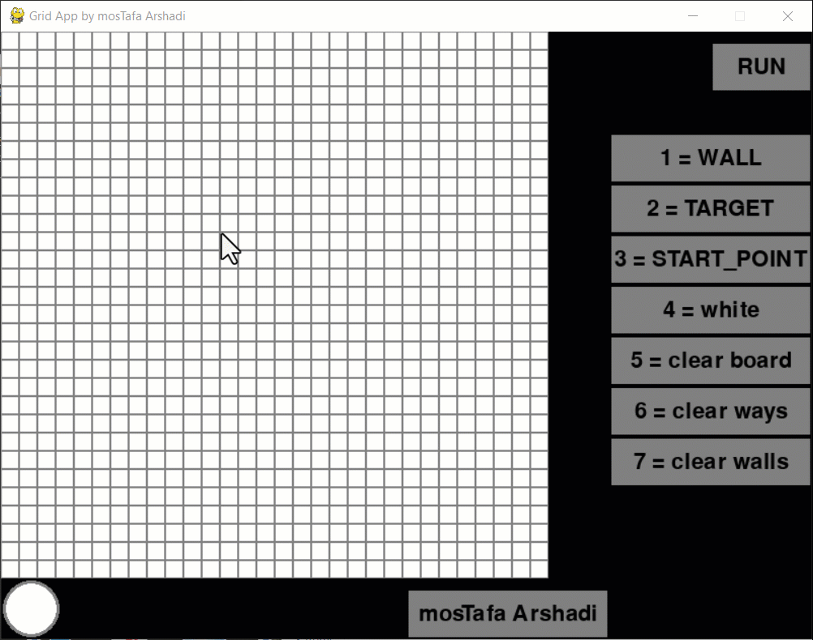

# Grid-Based Pathfinding Visualization
This project is a GUI implementation of the Breadth-First Search (BFS) algorithm for pathfinding, developed as part of a university project for a Data Structures course. The application allows users to visualize how the BFS algorithm finds the shortest path between a start point and an end point on a grid, while avoiding obstacles (walls) that can be drawn on the grid.

# Preview



## Features
- Interactive Grid Drawing: Users can draw walls, set a start point, and set a target point on the grid.
- Breadth-First Search (BFS) Algorithm: Visualizes the BFS algorithm in real-time to find the shortest path from the start point to the target point.
- Error Handling: Displays a message if no valid path is found.
- Clear Functions: Options to clear the board, walls, and paths.
- Intuitive Controls: Simple keyboard and mouse interactions to toggle between modes and execute the algorithm.
## Getting Started
### Prerequisites
- Python 3.7+
- Pygame
### Installation
- Clone the repository:

```bash
git clone https://github.com/yourusername/grid-pathfinding-visualization.git
cd grid-pathfinding-visualization
```
- Install the required Python packages:
```bash
pip install requirements.txt
```
### Run the application:

```bash
python main.py
```

## Usage
### Controls
- Draw Walls: Press 1 and then click and drag on the grid to draw walls.
- Set Target Point: Press 2 and then click on the grid to set the target point (only one target point is allowed).
- Set Start Point: Press 3 and then click on the grid to set the start point (only one start point is allowed).
- Erase Blocks: Press 4 and then click and drag on the grid to erase blocks.
- Clear Board: Press 5 to clear the entire grid.
- Clear Path: Press 6 to clear the drawn path without removing walls, start, or target points.
- Clear Walls: Press 7 to clear all walls.
- Run BFS Algorithm: Click the RUN button to execute the BFS algorithm and visualize the path from the start point to the target point.
### Example
- Press 1 and draw walls on the grid by clicking and dragging.
- Press 3 and click on the grid to set the start point.
- Press 2 and click on the grid to set the target point.
- Click the RUN button to visualize the BFS algorithm finding the path.

### File Structure
```bash
├── main.py         # Main application file that contains the Pygame loop and GUI logic
└── utils.py        # Utility file that contains the BFS algorithm and supporting classes
```
## Contributing
- Fork the repository
- Create your feature branch (git checkout -b feature/your-feature)
- Commit your changes (git commit -am 'Add your feature')
- Push to the branch (git push origin feature/your-feature)
- Open a Pull Request

## Acknowledgments
* Developed by [mosTafa Arshadi]
* Inspired by data structure lessons and the need for visual learning tools.
Feel free to reach out for any questions or suggestions to improve the project. Enjoy visualizing BFS algorithm with an interactive grid!